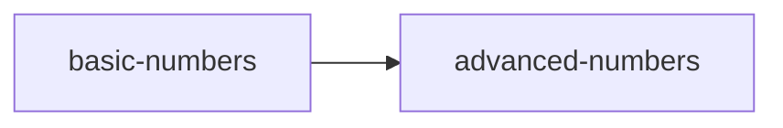

# Maintainers - How to get started

Firstly, thank you for your willingness to help with Exercism. We believe that v3 will be a huge step forward in our aim to offer a comprehensive, free learning website to anyone wanting to develop their programming skills, and we're really excited to see it play out.

**Before doing anything else, please create an issue in this repository asking for your track to be bootstrapped. You can then spend some time learning about the v3 process while we set things up for you.**

## Getting your track into shape

There are three stages to getting your track ready:

1. Understanding what needs doing
2. Preparing your track to accept contributions
3. Managing incoming contributions

We have tried to provide comprehensive documentation on what needs doing, starting with this file, and linking out. If anything can be made clearer, we would really appreciate PRs to these docs, so that we can help each other have the most seamless experience.

Once your track has been "boostrapped" you'll find a `languages/$LANG/README.md` file with a checklist of things to do. We recommend working through each one in turn. If your track has multiple maintainers we recommend scheduling a Slack conversation as a kick-off meeting and dividing up work and responsibilities. All maintainers will have been invited to Slack. If anyone isn't responding on Slack, please reach out to @ErikSchierboom on Slack, who can email them.

## New track structures

The key thing to understand about v3 is that we are making a strong distinction between Concept Exercises and Practice Exercises. All existing exercises will become Practice Exercises - exercises where students can practice the ideas they are learning, and discuss them with a mentor. The new Concept Exercises will be written from scratch, each with the aim of teaching one or more programming concepts that are necessary to become fluent in a given language.

We want to crowd-source the creation of these Concept Exercises, providing clear guidelines and instructions for contributors. We are doing this by asking maintainers to create a GitHub Issue for each Concept Exercise.

In order to do this maintainers need to understand what they think their tracks are going to look like. We have determined that the best way to do this is to start to list out all of the Concepts that someone needs to cover to learn a given language. Once this is done, you can start to turn each Concept into an issue that someone in the community can pick up and run with.

The final step to preparing your language to accept contributions is to provide a sample Concept Exercise that you have written. Not only does this act as an example for other contributors, it is also crucial for you understanding the process and getting your teeth into the detail.

We recommend choosing a Concept that involves working with basic types, like strings and numbers. Having chosen a Concept, look for the Concept's description in this reference part of this repository. This file should have references to all tracks that have implemented the exercise. You can use these existing implementations as a starting point for your first concept exercise, which you can then tailor to your specific language.

### Visualizing the planned track structure

You may find it helpful to create a graph that shows the unlock progression of the exercises for planning which exercises you need, which prerequisites they have and which exercises are closely related to each other.

The website supports flowcharts rendered by [mermaid](https://mermaid-js.github.io/mermaid/#/flowchart). Every code block with the language set to `mermaid` will be rendered as a graph:

    ```mermaid
        graph LR
            basic-numbers --> advanced-numbers
    ```



Please refer to the [mermaid documentation](https://mermaid-js.github.io/mermaid/#/flowchart) for detailed instructions. The Julia track's [progression planning document](./../../languages/julia/reference/progression.md) can also be used as a reference.

These will only be rendered on the [repo website](https://exercism.github.io/v3) or in a markdown editor that supports mermaid rendering, e.g. [Typora](https://www.typora.io/). See [website.md](./website.md) for instructions to run the website locally.

### Read more

- [More about Concepts and Concept Exercises](../concept-exercises.md)
- [How to determine Concepts for your track](./determining-concepts.md)
- [How to write Concept Exercise GitHub issues](./writing-a-concept-exercise-github-issue.md)
- [How the repository is structured](./repository-structure.md)
- [Migrating your config.json files](./migrating-your-config-json-files.md)
- [Frequently Asked Questions](./faqs.md)

## Tooling

As well as building out the Concept Exercises, your track will also need a Test Runner and a Representer.

The Test Runner is a piece of software that runs the tests. This enables us to have in-browser coding. Test Runners are surprisingly tricky to get right, with lots of weird edge cases and oddities, so we recommend starting on them quite early. You can learn more about Test Runners in the [automated testing repository](https://github.com/exercism/automated-tests).

Representers are pieces of software that take a solution and provide a normalised representation of it. We can then attach feedback to those representations, and automatically provide the same feedback for future solutions that normalise to the same representation. You may also like to create an Analyzer, which automatically provides feedback based on heursitics provided by AST matching. You can learn more about Representers and Analysers in our [automated analysis repository](https://github.com/exercism/automated-analysis).

## Getting help

Each track has a #maintaining-x channel on [Slack](https://exercism-team.slack.com). We recommend using that to chat amongst yourselves.

If you need help, the best place to use is the [#v3](https://exercism-team.slack.com/archives/CR91YFNG3) channel on Slack. This is a private space where maintainers from all tracks can help each other.

If you need to work through something more complex, please message @ErikSchierboom on Slack and schedule a time to pair with him.
