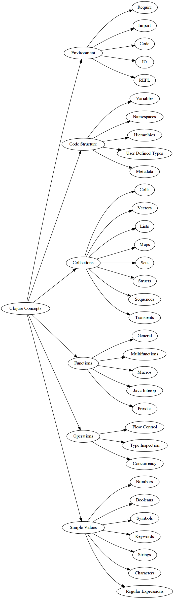

# Clojure reference

## Concepts

The Clojure concept exercises are based on concepts. The list below contains the concepts that have been identified for the Clojure language.

### Functional

The core features a Clojure developer should know about are:

- [REPL](../../../reference/concepts/repl.md)
- [Evaluation](../../../reference/concepts/evaluation.md)
- [Sameness](../../../reference/concepts/sameness.md)
- [Truthy and falsy](../../../reference/concepts/truthy_and_falsy.md)
- [Immutability](../../../reference/concepts/immutability.md)
- [Functions](../../../reference/concepts/functions.md)
- [Conditionals](../../../reference/concepts/conditionals.md)
- [Higher-order functions](../../../reference/concepts/higher_order_functions.md)
- [Sequence comprehensions](../../../reference/concepts/list_comprehension.md)
- [Anonymous functions](../../../reference/concepts/anonymous_functions.md)
- [Recursion](../../../reference/concepts/recursion.md)
- [Destructuring](../../../reference/concepts/destructuring.md)
- [State](../../../reference/concepts/state.md)
- [Metaprogramming](../../../reference/concepts/metaprogramming.md)
- [Macros](../../../reference/concepts/macros.md)

### Object-oriented

While Clojure is a functional language, it includes variations of concepts often associated with object oriented programming:

- [Polymorphism](../../../reference/concepts/polymorphism.md)
- [Multimethods](../../../reference/concepts/multiple-dispatch.md)

### Types

- Signed integers
- Unsigned integers
- Floating point numbers
- [Strings][string]
- [Characters][char]
- [Booleans][bool]
- [Vectors][array]
- [Lists][list]
- [Hashmaps][map]
- [Sets][set]

### Concepts graph

