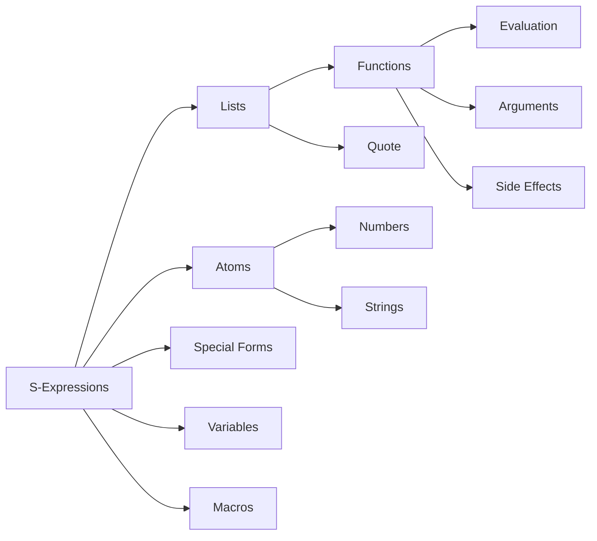

# Emacs Lisp Concept Exercise Progression

This is a working document to keep track of ideas and thoughts on how the progression through the Concept Exercises on the Emacs Lisp track could work.

```mermaid
graph LR
   S-Expressions --> Lists & Atoms & g2[Special Forms] & Variables & Macros
   Lists --> Functions & Quote
   Functions --> Evaluation & Arguments & g3[Side Effects]
   Atoms --> Numbers & Strings
```
