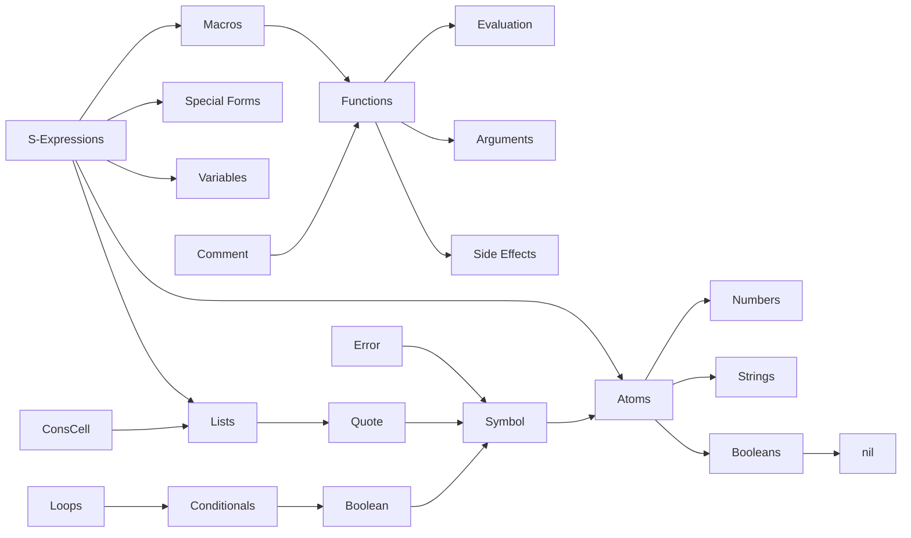
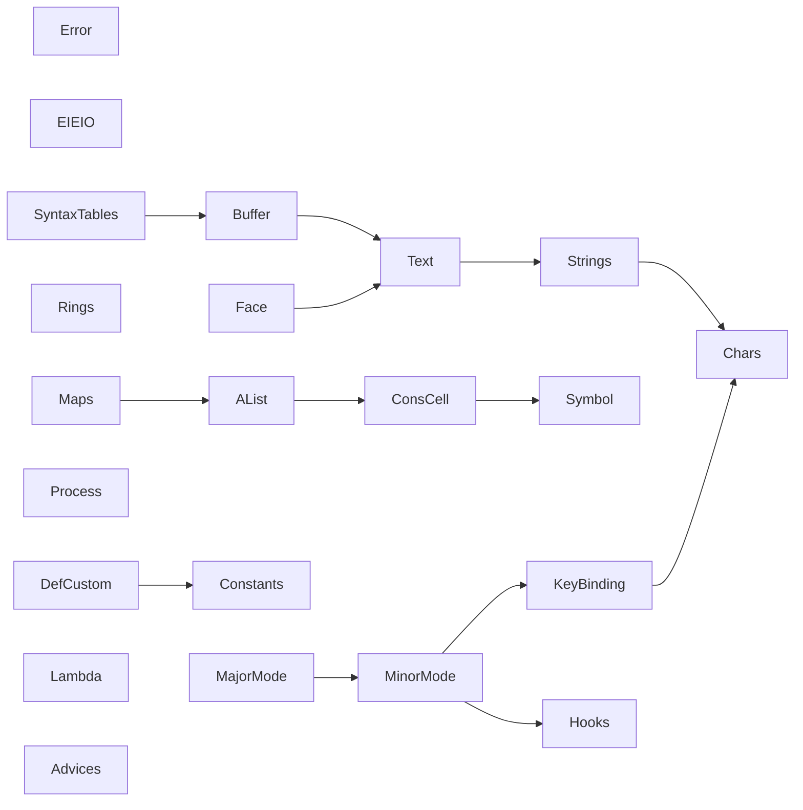

# Emacs Lisp Concept Exercise Progression

This is a working document to keep track of ideas and thoughts on how the progression through the Concept Exercises on the Emacs Lisp track could work.

First of all, a student should understand the basis of a Lisp language, illustrated on the concepts progression bellow:

A student would then need to understand emacs specific concepts, illustrated bellow:

