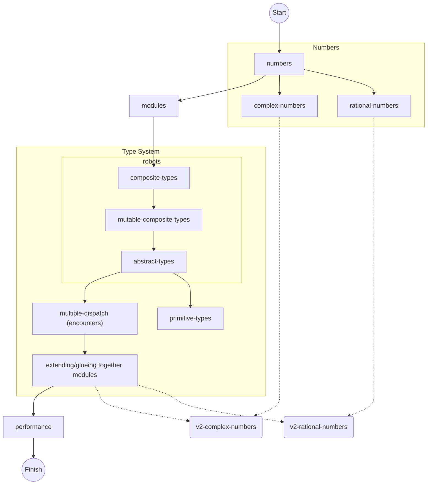

# Julia Concept Exercise Progression

This is a working document to keep track of ideas and thoughts on how the progression through the Concept Exercises on the Julia track could work.

## Core concepts that every student should definitely know after completing the track

- How to »think« Multiple Dispatch. Why and how can I implement an algorithm in a way that it »just works« when I throw a different type at it? If I implement a new type, how can I make it play nicely with existing algorithms and packages?

## Progression Tree

## Legend

- **Round edges & dotted lines** in the graph above are practice exercises that focus on a particular concept.
- **Q** refers to questions the student should be able to answer after solving it that aren’t directly taught by the exercise. Think of them like questions in the style of the Cornell Note Taking system.
- **PREV** means that the following point heavily depends on how the previous progression goes and thus is subject to change and/or to be decided
- **NEXT** means that this could either be part of this exercise or be the concept taught in the next exercise. In the diagram these are represented with dotted lines.

## Blocks

I think of closely coupled concepts/exercises as a “block” in the progression. The exercise may pick up parts from the previous exercise, extend them or depend on them.

### Multiple Dispatch

#### “Robots”

<!-- prettier-ignore -->
- Introduces **structs**
- Based on the existing exercises _robot-name_ and _robot-simulator_
- Might be split up in multiple exercises
- What is the student supposed to know after solving this exercise?
    1. How to define an immutable struct `NamedRobot` with field `name::String`
        - Provide Random-Name-Generator in hints but allow the student to implement their own
        - **Q:** Why should fields have a concrete type?
            - Add `@inferred` tests
    1. How to define a method that acts on the struct `name(r::NamedRobot)`
    1. How to define a mutable struct `MovingRobot` (?) with fields that describe the position
        - **PREV:** the position could be a `Complex{Int}`, a `(Named)Tuple{Int,Int}`, two fields `x`, `y` of type `Int`, a struct `Point{Int}`
        - **NEXT/PREV:** `Point{T<:Number}` could be used to introduce parametric types
    1. How to define methods that mutate the given argument `move!(r::MovingRobot)`
        - **Q:** Why does the function have a trailing `!`?
    1. **NEXT:** Define an abstract type `AbstractRobot` and `NamedRobot <: AbstractRobot`, `MovingRobot <: AbstractRobot`
    1. **PREV/NEXT:** Wrap it all in a module

#### “Encounters”

<!-- prettier-ignore -->
- Central exercise that teaches **multiple dispatch**
- Implementation is ‘fixed’ for now to avoid modifying to many variables at once
    - **NEXT:** Exception: Add `meets(::Pet, ::AbstractRobot)`
        - **Q:** What is **type piracy?**

### “Performance”

- Refactoring exercise, the student has to improve a solution that does several common performance gotchas wrong
- Hard to test
- Provide a list of things the student should have caught in `after.md`
- Provide benchmarking code
- Provide a list of tools to use (`Traceur.jl`, Profilers, BenchmarkTools etc.)
- Provide an achievable speed-up so that the student knows when they have optimised it well enough
- No micro-optimisations like `muladd` etc

### OffsetArrays

- Some exercise that shows that indexing is arbitrary in Julia, even if it defaults to 1-based indices.
- Also: How to write generic code that works regardless of index (see https://docs.julialang.org/en/v1/devdocs/offset-arrays/#Generalizing-existing-code-1)
