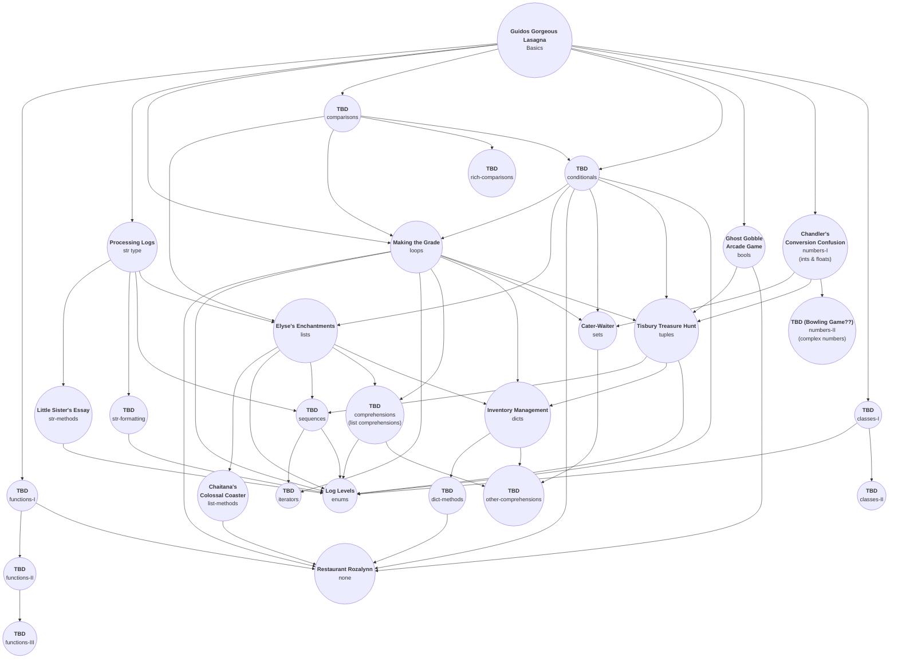

# Python concept exercises

| **Concept Name**   | **Exercise Name**                                                                                                                      | **Included Concepts**                   | **Prerequisites**                                                                                                              |
| ------------------ | -------------------------------------------------------------------------------------------------------------------------------------- | --------------------------------------- | ------------------------------------------------------------------------------------------------------------------------------ |
| `basics`           | [Guidos Gorgeous Lasagna](https://github.com/exercism/v3/tree/master/languages/python/exercises/concept/guidos-gorgeous-lasagna)       | `basics`                                | --                                                                                                                             |
| `bools`            | [ghost-gobble-arcade-game](https://github.com/exercism/v3/tree/master/languages/python/exercises/concept/ghost-gobble-arcade-game)     | `bools`                                 | `basics`                                                                                                                       |
| `comparisons`      | TBD (PR in progress)                                                                                                                   | `comparisons`                           | `basics`                                                                                                                       |
| `rich-comparisons` | TBD (split from comparisons)                                                                                                           | `rich-comparisons`                      | `comparisons`                                                                                                                  |
| `dicts`            | [Inventory Management](https://github.com/exercism/v3/tree/master/languages/python/exercises/concept/inventory-management)             | `dicts`                                 | `loops`, `lists`, `tuples`                                                                                                     |
| `enums`            | [log-levels](https://github.com/exercism/v3/tree/master/languages/python/exercises/concept/log-levels)                                 | `enums`                                 | `classes-I`, `conditionals`, `loops/iteration`, `comprehensions`, `sequences`, `string-formatting`, `string-methods`, `tuples` |
| `iteration/loops`  | [Making the Grade](https://github.com/exercism/v3/tree/master/languages/python/exercises/concept/making-the-grade)                     | `iteration`, `loops`, `range`           | `basics`, `comparisons`, `conditionals`, `lists`, `strings`                                                                    |
| `list-methods`     | [Chaitanas Colossal Coaster](https://github.com/exercism/v3/tree/master/languages/python/exercises/concept/chaitanas-colossal-coaster) | `list-methods`                          | `lists`                                                                                                                        |
| `lists`            | [Elyses Enchantments](https://github.com/exercism/v3/tree/master/languages/python/exercises/concept/elyses-enchantments)               | `list`                                  | `comparisons`, `conditionals`, `strings`                                                                                       |
| `none`             | [Restaurant Rozalynn](https://github.com/exercism/v3/tree/master/languages/python/exercises/concept/restaurant-rozalynn)               | `None`                                  | `bools`, `conditionals`, `functions-I`, `dict-methods`, `list-methods`, `loops/iteration`                                      |
| `numbers-I`        | Currency Exchange/Chandler's Conversion Confusion (PR in process)                                                                      | `numbers`, `ints`, `floats`, Arithmetic | `basics`                                                                                                                       |
| `numbers-II`       | TBD (PR in process)                                                                                                                    | `complex`, imaginary                    | `numbers-I`                                                                                                                    |
| `str`              | [Processing Logs](https://github.com/exercism/v3/tree/master/languages/python/exercises/concept/processing-logs)                       | `str`                                   | `basics`                                                                                                                       |
| `str-formatting`   | TBD (PR in process)                                                                                                                    | `str-formatting`                        | `basics`, `strings`, `string-methods-I`                                                                                        |
| `str-methods`      | [Litte Sister's Essay](https://github.com/exercism/v3/tree/master/languages/python/exercises/concept/little-sisters-essay)             | `str-methods`                           | `basics`, `strings`                                                                                                            |
| `str-methods-II`   | TBD (PR in process)                                                                                                                    | `str-splitting`, `string processing`    | `basics`, `strings`, `string-methods-I`                                                                                        |
| `tuples`           | [Tisbury Treasure Hunt](https://github.com/exercism/v3/tree/master/languages/python/exercises/concept/tisbury-treasure-hunt)           | `tuple`                                 | `bools`, `loops`, `conditionals`, `numbers-I`                                                                                  |

## Chart

