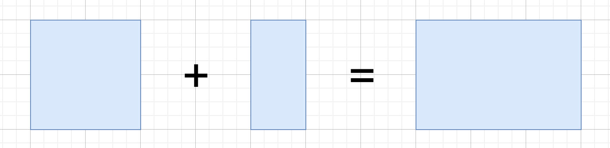
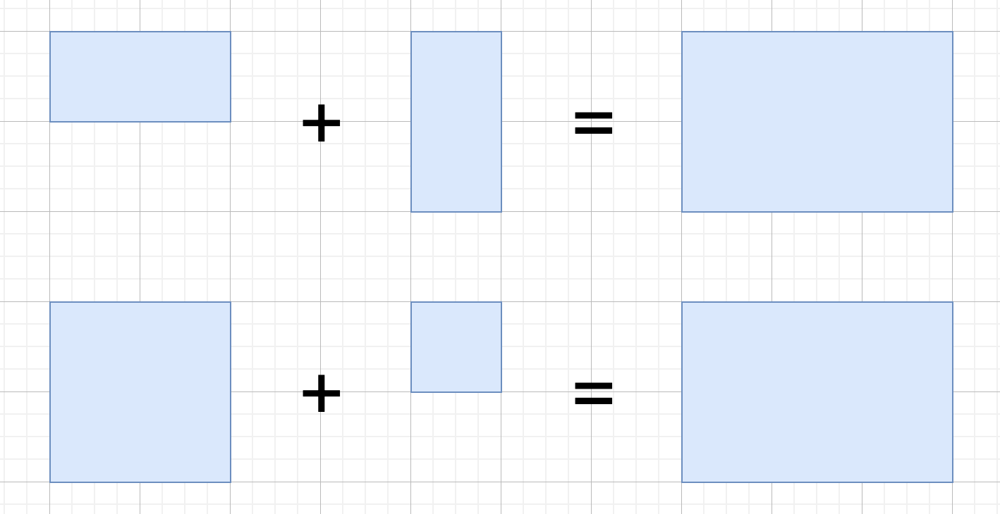
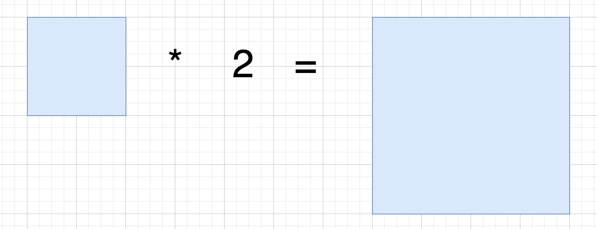

In this exercise you're going to write some code to calculate with rectangles.

Given is a case class `Rectangle`. A rectangle is defined by its width and its height:

```scala
case class Rectangle(width: Int, height: Int)
```

## 1. Create a plus operator for rectangles

Implement a `+` method that takes another rectangle as argument. Assume that the passed rectangle has the same height as the current one. The method should return a new rectangle, whose width is a sum of both rectangles and whose height is the same as of both rectangles.

Let's visualize the expected outcome:



```scala
val leftRectangle = Rectangle(2, 5)
val rightRectangle = Rectangle(1, 5)
val sumRectangle = leftRectangle + rightRectangle
println(sumRectangle)
// => Rectangle(3, 5)
```

## 2. Enhance the plus operator

How to deal with rectangles of different heights? In this task please update the `+` method like follows: The new rectangle should get the height of the higher rectangle.

Let's visualize again the expected outcome:



```scala
val leftRectangle = Rectangle(2, 4)
val rightRectangle = Rectangle(1, 1)
val sumRectangle = leftRectangle + rightRectangle
println(sumRectangle)
// => Rectangle(3, 4)
```

## 3. Create a multiply operator for rectangles

Implement a `*` method, which takes an Int parameter and returns an expanded rectangle, whose width and height are multiplied by the given parameter.



```scala
val originalRectangle = Rectangle(2, 3)
val expandedRectangle = originalRectangle * 3
println(expandedRectangle)
// => Rectangle(6, 9)
```
