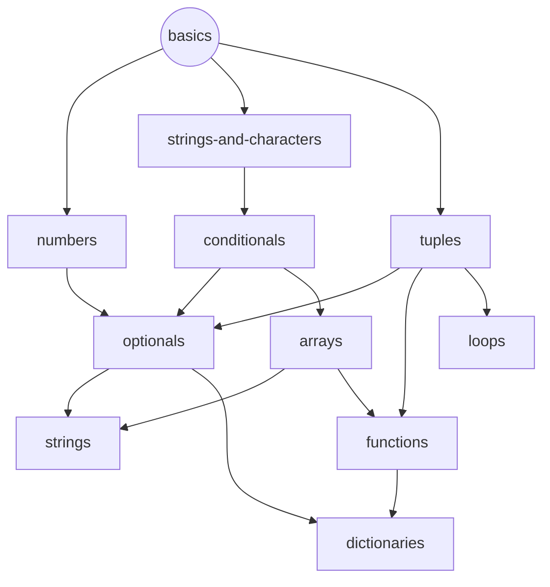

# Swift Concept Exercise Progression

This is a working document to keep track of ideas and thoughts on how the progression through the Concept Exercises on the Swift track could work.

## Core concepts that every student should definitely know after completing the track

- Value types v. Reference types
- Structs v. Classes
- Higher-order functions
- Protocol-oriented programming

## Progression Tree

